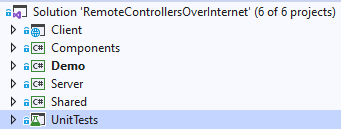

## Project structure

If you open the Solution explorer, you can see several projects 

The solution contains:

- **Client** - Web Assembly downloaded into your browser. This project takes care about how the web application looks like and behaves.
- **Components** - Library provides razor components which are used by **Client** (Buttons etc..).
- **Server** - Starts a Http server which routes to **Client** and provides a communication between user's browser and **Server**. 
- **Shared** - Other classes are used **Client**, **Components** and **Server**.
- **Demo** - Shows you how to use the library

#### Frameworks

| Project    | Target Framework | Application type              |
| ---------- | ---------------- | ----------------------------- |
| Client     | netstandard2.1   | Blazor WebAssembly            |
| Components | netstandard2.0   | Razor Component Library       |
| Server     | netcoreapp3.1    | .Net Core Library             |
| Shared     | netstandard2.0   | .Net Core Library             |
| Demo       | netcoreapp3.1    | .Net Core Console Application |
| UnitTests  | netcoreapp3.1    | MSUnitTests                   |

#### Important files

- {ApplicationName}.StaticWebAssets.xml - Is located in bin and takes care about mapping URL to static files (index.html etc.) 

#### Client

// TODO

#### Components

// TODO

#### Server

##### ClientManager

##### Server

##### StartUp

##### WebSocketMiddleware

##### Extensions

// TODO

#### Shared

// TODO

#### Demo

#### UnitTests