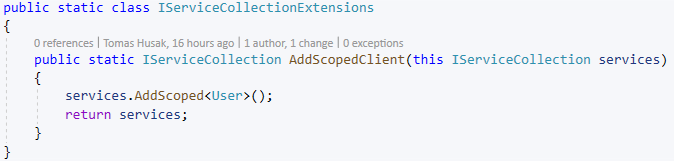

# User's manual

### Compilation

We will use Visual Studio 2019.

### Guide

I made demo to show you how to use this library. Examples are chose from the demo. See /Demo folder for complete example.

#### Overview

Project contains 3 .dll library : **Server.dll**, **Shared.dll**, **Components.dll**. **Server.dll** provides server side of application. **Components.dll** provides predefined razor components like ButtonController which represents button. **Shared.dll** is used by Server.dll and Components.dll and contains additional data structures.

 Versions of .dlls.

| .dll           | Version                        |
| -------------- | ------------------------------ |
| Server.dll     | netstandard2.0                 |
| Shared.dll     | netcoreapp3.1                  |
| Components.dll | netstandard2.0, razor lang 3.0 |

#### Server side

We will start with server side. 

Create new project. Project should have reference to **AspNetCore** framework or you have to add a lot of nugget packages. Copy **Server.dll** and **Shared.dll** into bin folder and add dependencies to them. Now you can use API of them.  

 

There can be issues with versions of nuggets, so you just add appropriate version. As you can see in the example, newer Dependency Injection is added.

If you want to make own configuration of server you need also **WebAssembly.Server** nugget which provides useful methods to host Blazor app.

You can see also two additional dependencies: **Client.dll** and **Shared.dll** in the example. There are additional user defined controllers in **Client.dll** and useful data structures in **Shared.dll**, so you have to include it to have a option to use it.

This is main usage of Server. You can make your own **StartUp**(*MyStartUp*) class to configure server and own **Client**(*MyPlayer*) refers to a connection. Or you can just use predefined classes *StartUp* and *Player*. 

Method *RunAsync* run http server(In this example *Kestrel*). I will talk about client side later in this article.

You can see *manager* which represents a data structure cares about handling clients. Method *ReceiveEventAsync* waits until a first message of *ControllerEvent* type arrives.

      

Classes, which inherits *ControllerEvent*, can be sent to client or can be received from client. Classes, which inherits *ControllerEvent*, have to define new *TryDecode* method. 

 

There are other types of messages. Configuration message is a special message to get to know receiving point about how to decode incoming message. You just connect some id with Type class, which represent class of ControllerEvent or their children, and send it. From now, client can read this type of message with this ID. You can not send other type of message with the ID. But you can change it by another configuration message.

#### Client side

You will start with Blazor web assembly project. In other to server can send **WASM** to client browser, you have to copy bin folder to Server side app with all static files (*wwwroot*).

**Client.dll** is a Blazor WebAssembly and **wwwroot** contains static files with **WASM** framework. All of these files with other .dll generated by Client are copied into bin folder of server side app.

Now what you need to know about an implementation of Blazor WebAssembly. All what you need is to include **Components.dll** and **Shared.dll** which provides you Razor components and *ControllerEvents*.

*ButtonController* is predefined Razor component in Components.dll. This component inherits *RemoteControllerBase*. 

As you can see it is common Razor component which has some callbacks.

How to send the events?

You have to connect to server. *User* class provide method *ConnectAsync*. After the websocket connection is established, you have to send configuration message as you saw in the previous section with the server. After that you can send events by *SendAsync* method.

*_user* is type of *User* which can be added as a service.